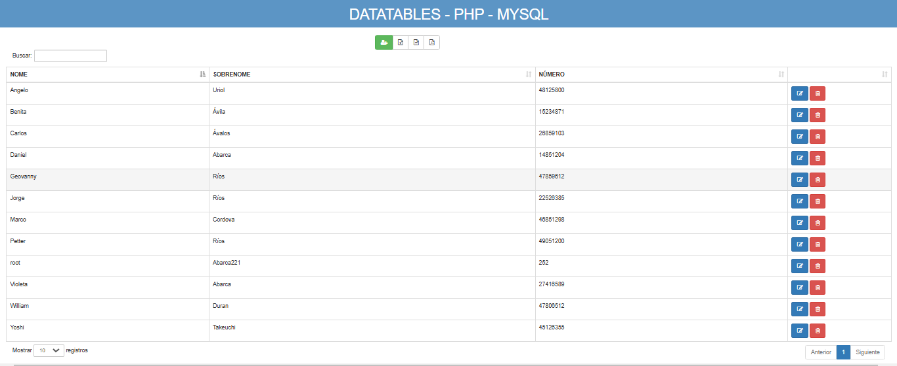
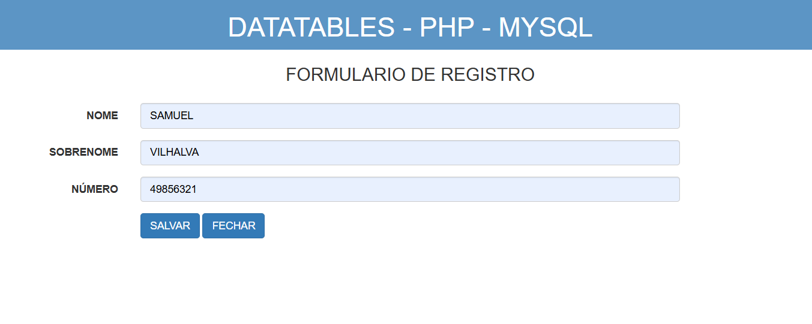
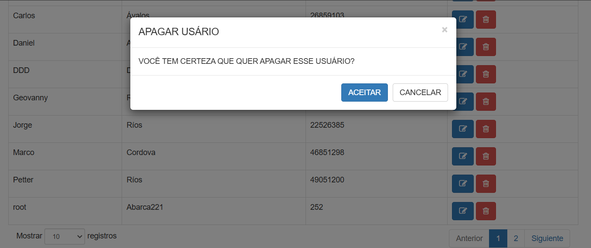

# DATATABLES PHP MYSQL
👨‍🏫CRUD EM PHP, MYSQL, DATATABLES, BOOTSTRAP E JQUERY.

 <br>
 <br>
 <br>
 <br>

## DESCRIÇÃO:
Este projeto é um **CRUD** básico (Create, Read, Update, Delete) usando **PHP**, **MySQL**, **jQuery**, e **DataTables**. Ele permite gerenciar informações de usuários com funcionalidades de adição, listagem, edição e exclusão diretamente por meio de uma interface web. 

## FUNCIONALIDADES:
1. **Adicionar Usuário:**
   - Um formulário permite a inserção de nome, sobrenome e número do usuário.
   - Os dados são enviados via AJAX para o servidor (`guardar.php`) para serem registrados no banco de dados.

2. **Listar Usuários:**
   - Uma tabela gerada pela biblioteca **DataTables** exibe os usuários cadastrados.
   - A tabela é preenchida dinamicamente com dados do servidor (`listar.php`) usando AJAX.

3. **Editar Usuário:**
   - Botão "Editar" na tabela permite carregar os dados do usuário selecionado no formulário.
   - Após a edição, o formulário envia as alterações via AJAX ao servidor.

4. **Excluir Usuário:**
   - Botão "Excluir" na tabela abre um modal de confirmação.
   - Após a confirmação, o usuário é marcado como inativo no banco de dados.

5. **Mensagens de Feedback:**
   - O sistema exibe mensagens informativas para ações bem-sucedidas, erros, ou casos específicos como duplicidade de usuários.

## EXECUTANDO O PROJETO:
1. **Configuração do Banco de Dados:**
   - Antes de executar o site, é necessário importar o arquivo `./DATABASE/DATABASE.sql`. 

2. **Configuração do PHP:**
   - Abra o arquivo `./CODIGO/conexion.php` e ajuste as configurações do banco de dados:

     ```php
       $server = "localhost";
       $user = "seu_usuario";
       $password = "sua_senha";
       $bd = "prova";
     ```

3. **Executando o Aplicativo com Apache:**
   - Coloque os arquivos em um servidor web compatível com PHP (por exemplo, XAMPP, WAMP, LAMP).
   - Acesse o formulário no navegador visitando [http://localhost/CODIGO/index.html](http://localhost/CODIGO/index.html).

4. **Executando o Aplicativo com `php.exe`:**
   - Alternativamente, você pode iniciar o servidor diretamente no diretório `./CODIGO` com o comando abaixo:
   ```bash
   php -S localhost:8080
   ```
   - Em seguida, acesse o formulário no navegador através do endereço: [http://localhost:8080](http://localhost:8080).

5. **Adição de Usuário:**
   - **Ação**: Clique no ícone de `+` no canto superior esquerdo da tabela para abrir o formulário de adição de usuário.
   - **Objetivo**: Adicionar um novo usuário na tabela preenchendo os campos do formulário (Nome, Sobrenome e Telefone).
   - **Verificação**: Após a inserção dos dados, clique em "SALVAR". Verifique se o novo usuário é adicionado corretamente à tabela.
   - **Recurso do DataTables**: A tabela será automaticamente atualizada sem a necessidade de recarregar a página, utilizando a funcionalidade de *AJAX*.

6 **Edição de Usuário:**
   - **Ação**: Clique no ícone de "Editar" (geralmente representado por um lápis) na linha do usuário que você deseja editar.
   - **Objetivo**: Alterar informações de um usuário já existente.
   - **Verificação**: Confirme se as alterações são refletidas na tabela após salvar.
   - **Recurso do DataTables**: A tabela será atualizada dinamicamente após a edição, sem recarregar a página, utilizando recursos como *inline editing*.

7. **Exclusão de Usuário:**
   - **Ação**: Clique no ícone de "Excluir" (geralmente representado por uma lixeira) na linha do usuário que você deseja remover.
   - **Objetivo**: Remover um usuário da tabela.
   - **Verificação**: Verifique se o usuário foi removido corretamente da tabela.
   - **Recurso do DataTables**: Após a exclusão, a tabela será atualizada automaticamente para refletir a remoção do item.

8. **Recursos Habilitados no DataTables:**
   - **Pesquisa Global**: Permite ao usuário realizar uma pesquisa em todas as colunas da tabela ao digitar no campo de pesquisa.
   - **Paginação**: Exibe um número limitado de registros por página e permite navegar entre as páginas.
   - **Ordenação de Colunas**: O usuário pode ordenar as linhas da tabela clicando nos cabeçalhos das colunas.
   - **Filtro de Colunas**: Filtragem em tempo real para cada coluna, caso seja configurado.
   - **Edição Inline**: Funcionalidade para editar registros diretamente na tabela sem abrir formulários separados.
   - **Carregamento Dinâmico (AJAX)**: Suporte para carregar dados dinamicamente sem a necessidade de recarregar a página, utilizando chamadas AJAX.
   - **Botões de Ação**: Inclusão de ícones de ação, como editar e excluir, para cada linha da tabela, oferecendo um controle mais dinâmico dos registros.

9. **Exportação de Dados:**
   - **Ação**: Clique nos ícones de exportação localizados no canto superior da tabela.
   - **Objetivo**: Baixar a tabela de dados em diferentes formatos, como *XLSX*, *CSV* e *PDF*.
   - **Recurso do DataTables**: 
     - **XLSX**: Baixa os dados da tabela em formato Excel.
     - **CSV**: Baixa os dados em formato CSV (Comma Separated Values).
     - **PDF**: Baixa a tabela em formato PDF, preservando a formatação.

## NÃO SABE?
- Entendemos que para manipular arquivos em `HTML`, `CSS` e outras linguagens relacionadas, é necessário possuir conhecimento nessas áreas. Para auxiliar nesse aprendizado, oferecemos cursos gratuitos disponíveis:
* [CURSO DE HTML E CSS](https://github.com/VILHALVA/CURSO-DE-HTML-E-CSS)
* [CURSO DE PHP](https://github.com/VILHALVA/CURSO-DE-PHP)
* [CURSO DE JAVASCRIPT](https://github.com/VILHALVA/CURSO-DE-JAVASCRIPT)
* [CURSO DE JQUERY](https://github.com/VILHALVA/CURSO-DE-JQUERY)
* [CURSO DE BOOTSTRAP](https://github.com/VILHALVA/CURSO-DE-BOOTSTRAP)
* [CURSO DE DATATABLES](https://github.com/VILHALVA/CURSO-DE-DATATABLES)
* [CURSO DE MYSQL](https://github.com/VILHALVA/CURSO-DE-MYSQL)
* [CURSO DE PHP COM MYSQL](https://github.com/VILHALVA/CURSO-DE-PHP-COM-MYSQL)
* [CONFIRA MAIS CURSOS](https://github.com/VILHALVA?tab=repositories&q=+topic:CURSO)

## CREDITOS:
- [PROJETO CRIADO PELO "CodigoWolf"](https://github.com/CodigoWolf/Datatables-jQuery-PHP-MySql-MariaDB-CRUD)
- [PROJETO MODIFICADO PELO VILHALVA](https://github.com/VILHALVA)


